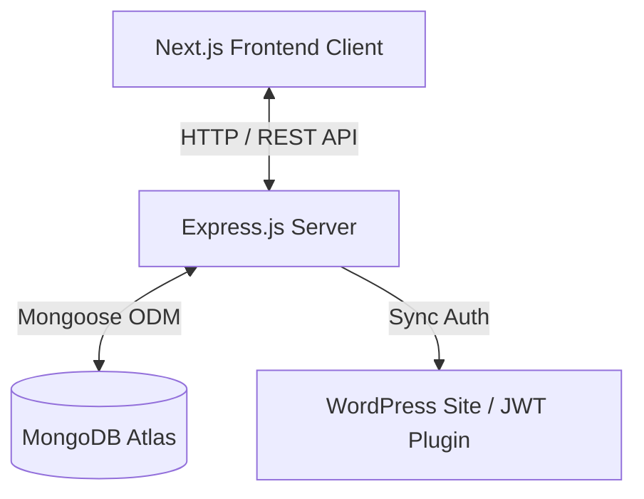
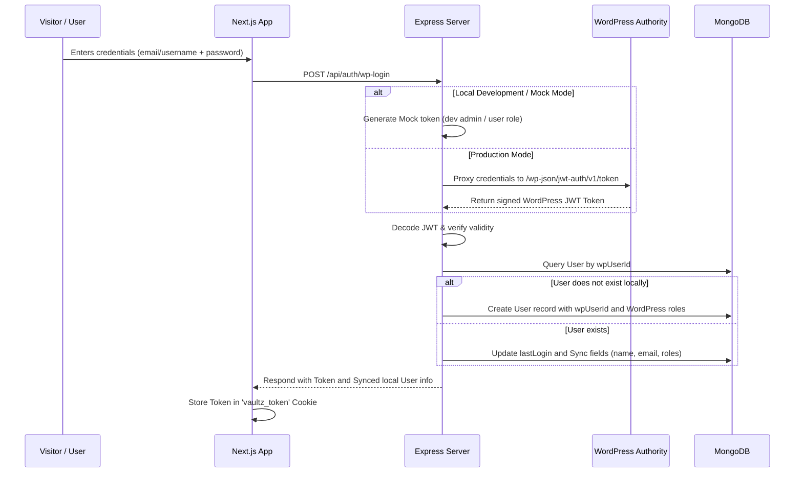
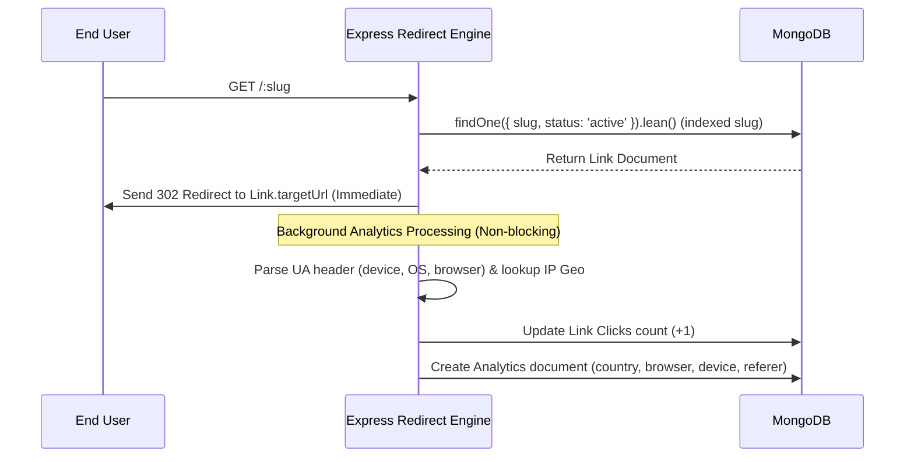

# System Architecture Documentation

Vaultz Links is a high-performance URL shortener application designed with a decoupled Client-Server architecture. It features a Next.js (React) frontend client, a Node.js/Express.js backend API, and a MongoDB Atlas document store, with synchronization integration for WordPress JWT authentication.

## 1. High-Level Architecture Overview

- **Client Layer (Next.js)**: Runs a responsive single-page dashboard. Communicates with the Express API via Axios. Restores authentication using a Secure JWT cookie (`vaultz_token`).
- **Server Layer (Express.js)**: Orchestrates routes, database communication, analytics compilation, and URL redirection logic.
- **Redirection Engine**: Intercepts paths matching `/:slug` (before other Express routes) to immediately redirect users using a fast Mongoose `.lean()` read, while non-blocking analytics logs are generated in the background.
- **Identity & Data Store (MongoDB Atlas)**: Stores details of users synced from WordPress, link slugs, customized QR codes metadata, and click analytics.

## 2. Authentication Flow (WordPress JWT Sync)

Vaultz Links integrates authentication using the WordPress JWT Auth Plugin structure. The flow is as follows:

## 3. High-Performance Redirect and Analytics Flow

Redirection requests must be fast. The analytics logging is offloaded asynchronously so the user gets redirected immediately without waiting for database writes:

## 4. Production Security Hardening

To make the codebase ready for enterprise-level deployments, the following layers have been integrated:
- **Rate Limiting**: Custom thresholds shield the Express router from excessive traffic (general API rate limit: 100/15min; login: 15/15min; redirects: 1000/min).
- **Security Headers (Helmet)**: Sets standard headers to prevent Cross-Site Scripting (XSS), Clickjacking, and MIME Sniffing.
- **NoSQL Injection Guard (mongoSanitize)**: Automatically filters request body, parameters, and query parameters to strip MongoDB operators starting with `$` or containing `.`.
- **ReDoS Protection**: Search queries are sanitized by escaping all regex special characters before being passed to Mongoose `$regex` queries.
- **Startup Enforcements**: Fails early in production if key variables like `MONGO_URI` or `WP_JWT_SECRET` are missing or default.
