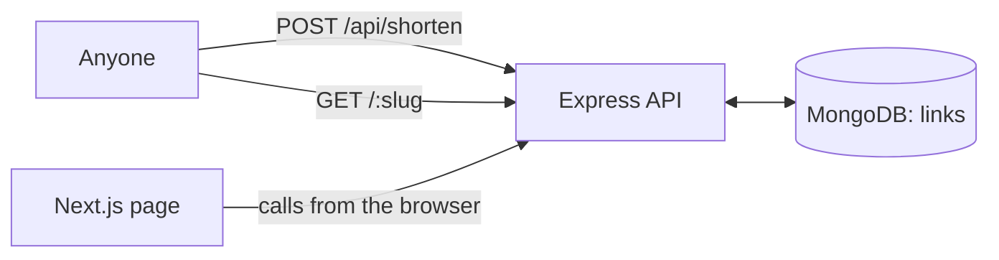

# System Architecture

Vaultz Links is a small, open URL shortener: a Next.js page where anyone can create a link, and an Express + MongoDB API that stores links and redirects visitors. There are no accounts, logins or keys.

```mermaid
graph LR
    User[Anyone] -->|POST /api/shorten| API[Express API]
    User -->|GET /:slug| API
    Page[Next.js page] -->|calls from the browser| API
    API <--> DB[(MongoDB: links)]
```

## Creating a link
1. Anyone opens the page, enters a long URL and an optional custom slug.
2. The browser calls `POST /api/shorten` on the API directly (so rate limiting sees each person's own IP).
3. The API validates the URL (http/https only, not on the short domain itself), picks the slug (custom or random) and stores the link.

## Redirect
`GET /:slug` runs a single `findOneAndUpdate` that finds the active link and increments `clicks`, then sends a `302` to the target URL. Unknown slugs get a small 404 page.

## Click counter
Each redirect adds 1 to `clicks`. The page's "Check clicks" box reads it with `GET /api/stats/:slug`. Click counts are public.

## Abuse protection
Because creation is open, these guards matter:
- Rate limits per IP: creation 30 / 15 min, API 300 / 15 min, redirects 1000 / min.
- Only `http` / `https` targets; links to the short domain itself are rejected; slugs `api` and `health` are reserved.
- Helmet headers, CORS allowlist (`CLIENT_URL`), Mongo operator sanitising, 10kb body limit.

There is no link review or blocklist, so someone could create a short link to a harmful site on your domain. If that becomes a problem, add the access key back, or a blocklist / Google Safe Browsing check.
